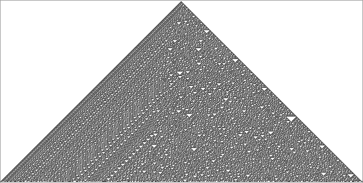
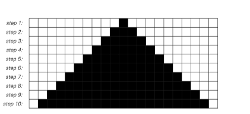
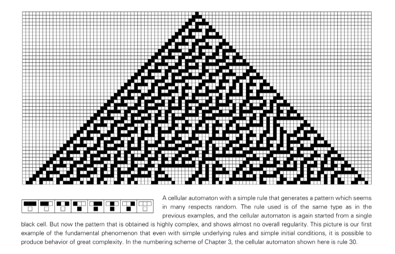

# The Crucial Experiment

## How Do Simple Programs Behave

Any program can at some level be thought of as consisting of a set of rule that specify what it should do at each step. One example is **cellular automata**.

Here is an example of cellular automat: 

The cellular automata is fairly simple:
- It represent by grid of cells and each roll represent a step.
- The color of each cell are decided by it's neighbor and itself's previous status.
- Let it iterate for several steps, we can see the representation of it.

For example, if we set rule as "A particular cell is made black whenever it or either of its neighbors were black on the step before", then we can get a most basic cellular automat out:

We might assume that all of rules will generates patterns as simple as we have seen. But it turns out to be wrong, for example, and it rules also shown: 

 

This randomness still exists for the following millions steps. There is a certain simplicity to such perfect randomness. For even though it may be impossible to predict what color will occur at any specific step, one still knows for example that black and white will on average always occur equally often.

But it turns out that there are cellular automata whose behavior is in effect still more complex -- and in which even such averages become very difficult to predict. 

## The Need for a New Intuition

Based our experience, we expect that an object looks complicated must have been constructed in a complicated way. But the result of cellular automata shows that sometimes such assumption can be wrong. 

One might hope that it would be possible to call on some existing kind of intuition to understand such a fundamental phenomenon. But in fact there seems to be no branch of everyday experience that provides what is needed. And so we have no choice but to try to develop a whole new kind of intuition. And the only reasonable to do is to expose ourselves to a large number of examples. 